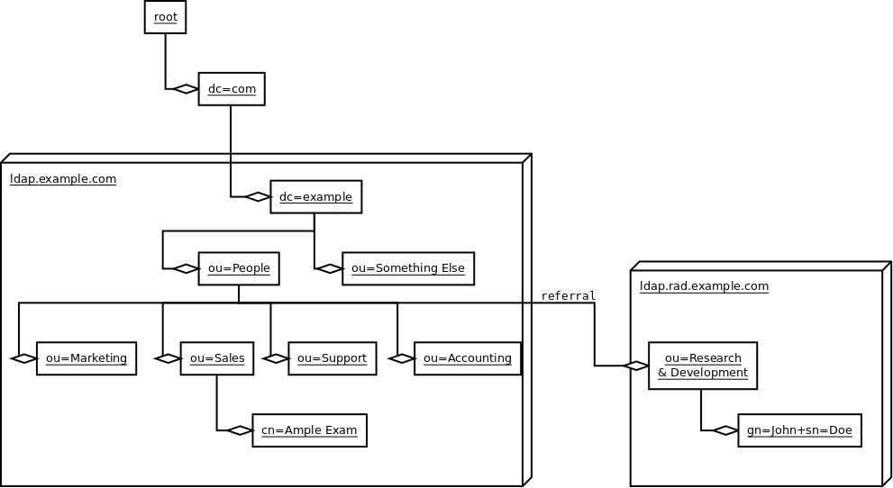
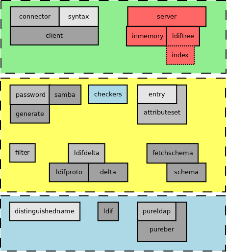
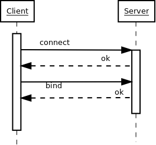
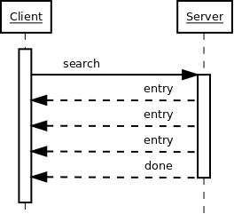
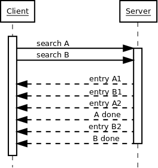
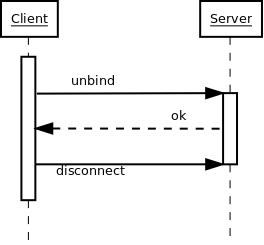
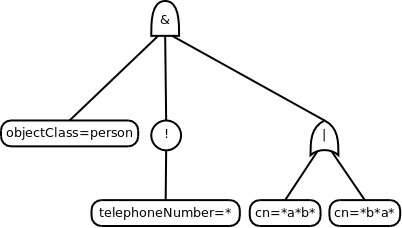

==================================
Creating a simple LDAP application
==================================

--------------
An LDAP Primer
--------------
Entries in an LDAP directory information tree (DIT) are arranged in a 
hierarchy.

:term:`LDIF` is a textual representation of entries in the DIT.

Writing things down, John Doe LDIF::

    dn: gn=John+sn=Doe,ou=Research & Development,ou=People,dc=example,dc=com
    objectClass: addressbookPerson
    gn: John
    sn: Doe
    street: Back alley
    postOfficeBox: 123
    postalCode: 54321
    postalAddress: Backstreet
    st: NY
    l: New York City
    c: US

Writing things down, John Smith LDIF::

    dn: gn=John+sn=Smith,ou=Marketing,ou=People, dc=example,dc=com
    objectClass: addressbookPerson
    gn: John
    sn: Smith
    telephoneNumber: 555-1234
    facsimileTelephoneNumber: 555-1235
    description: This is a description that can span multi
     ple lines as long as the non-first lines are inden
     ted in the LDIF.

------------------------------------
Asynchronous LDAP Clients and Servers
------------------------------------

Ldaptor is a set of pure-Python LDAP client and server protocols and libraries..

It is licensed under the MIT (Expat) License.

--------------------------------
Working with Distinguished Names
--------------------------------

.. code-block:: python

    >>> from ldaptor.protocols.ldap import distinguishedname
    >>> dn=distinguishedname.DistinguishedName(
    ... 'dc=example,dc=com')
    >>> dn
    DistinguishedName(listOfRDNs=(RelativeDistinguishedName(
    attributeTypesAndValues=(LDAPAttributeTypeAndValue(
    attributeType='dc', value='example'),)),
    RelativeDistinguishedName(attributeTypesAndValues=(
    LDAPAttributeTypeAndValue(attributeType='dc', value='com'),))))
    >>> str(dn)
    'dc=example,dc=com'

-------------------
Overview of Ldaptor
-------------------

-------
Twisted
-------

Twisted is an event-driven networking framework written in Python and licensed under the MIT (Expat) License.

Twisted supports TCP, UDP, SSL/TLS, multicast, Unix sockets, a large number of protocols (including HTTP, NNTP, SSH, IRC, FTP, and others), and much more.

Twisted includes many full-blown applications, such as web, SSH, FTP, DNS and news servers.

-------------------------------
Connect to a DIT Asynchronously
-------------------------------

Ldaptor contains helper classes to simplify connecting to an LDAP DIT.

.. code-block:: python

    >>> from ldaptor.protocols.ldap import ldapclient, ldapconnector
    >>> from twisted.internet import reactor
    >>> connector=ldapconnector.LDAPClientCreator(reactor, ldapclient.LDAPClient)
    >>> connector
    <ldaptor.protocols.ldap.ldapconnector.LDAPClientCreator
    instance at 0x40619b6c>
    >>> d = connector.connectAnonymously(dn, {dn: ('localhost', 10389)})
    >>> d
    <Deferred at 0x402d058c>

---------
Deferreds
---------

- A promise that a function will at some point have a result.
- You can attach callback functions to a Deferred.
- Once it gets a result these callbacks will be called.
- Also allows you to register a callback for an error, with the default behavior of logging the error.
- Standard way to handle all sorts of blocking or delayed operations.

---------
Searching
---------

Once connected to the DIT, and LDAP client can search for entries.

.. code-block:: python

    >>> from twisted.trial.util import deferredResult
    >>> proto = deferredResult(d)
    >>> proto
    <ldaptor.protocols.ldap.ldapclient.LDAPClient
    instance at 0x40619dac>
    >>> from ldaptor.protocols.ldap import ldapsyntax
    >>> baseEntry = ldapsyntax.LDAPEntry(client=proto, dn=dn)
    >>> d2 = baseEntry.search(filterText='(gn=j*)')
    >>> results = deferredResult(d2)

-------
Results
-------

Search results are a list of LDAP entries.

.. code-block:: python

    >>> results
    [LDAPEntry(dn='givenName=John+sn=Smith,ou=People,
    dc=example,dc=com', attributes={'description': ['Some text.'],
    'facsimileTelephoneNumber': ['555-1235'], 'givenName': ['John'],
    'objectClass': ['addressbookPerson'], 'sn': ['Smith'],
    'telephoneNumber': ['555-1234']}), LDAPEntry(dn=
    'givenName=John+sn=Doe,ou=People,dc=example,dc=com',
    attributes={'c': ['US'], 'givenName': ['John'], 'l': ['New York City'],
    'objectClass': ['addressbookPerson'], 'postOfficeBox': ['123'],
    'postalAddress': ['Backstreet'], 'postalCode': ['54321'],
    'sn': ['Doe'], 'st': ['NY'], 'street': ['Back alley']})]

------------------
Results one-by-one
------------------

You can inspect individual results in the result list.

.. code-block:: python

    >>> results[0]
    LDAPEntry(dn=
    'givenName=John+sn=Smith,ou=People,dc=example,dc=com',
    attributes={'description': ['Some text.'],
    'facsimileTelephoneNumber': ['555-1235'], 'givenName': ['John'],
    'objectClass': ['addressbookPerson'], 'sn': ['Smith'],
    'telephoneNumber': ['555-1234']})
    >>> results[3]
    Traceback (most recent call last):
      File "<stdin>", line 1, in ?
    IndexError: list index out of range

-----------
LDIF output
-----------

Search results can be printed as LDIF output.  LDIF output
can be used by other LDAP tools.

.. code-block:: python

    >>> print(results[0])
    dn: givenName=John+sn=Smith,ou=People,dc=example,dc=com
    objectClass: addressbookPerson
    description: Some text.
    facsimileTelephoneNumber: 555-1235
    givenName: John
    sn: Smith
    telephoneNumber: 555-1234

----------------------
Closing the connection
----------------------

Unlike an HTTP connection, an LDAP connection persists until the client
indicates it is done or the server forcibly terminates the connection
(e.g. a TCP socket times out).

.. code-block:: python

    >>> proto.unbind()

-----------------------
Access to entry details
-----------------------

LDAP entries have a dictionary-like interface.  Attributes are accessed
like dictionary keys.  The values are always a list of one or more values.

.. code-block:: python

    >>> smith = results[0]
    >>> print(smith.dn)
    givenName=John+sn=Smith,ou=People,dc=example,dc=com
    >>> smith['givenName']
    ['John']
    >>>

------------------------
Anatomy of an LDAP entry
------------------------

LDAP entries can "implement" multiple objectClasses.

All objectClasses can inherit zero, one or many objectClasses, just like programming classes.

All objectClasses have a root class, known as `top`; many object oriented programming languages have a root class, e.g. named `Object`.

All objectClasses are either `STRUCTURAL` or `AUXILIARY`; entries can only implement one `STRUCTURAL` objectClass.

Lastly, objectClasses of an entry can be changed at will; you only need to take care that the entry has all the `MUST` attribute types, and no attribute types outside of the ones that are `MUST` or `MAY`.

.. NOTE::
    Note that e.g. OpenLDAP doesn't implement this.

Attributes of an entry closely match attributes of objects in programming languages; however, LDAP attributes may have multiple values.

-------------
Search inputs
-------------

An example search filter: ``(cn=John Smith)``

A search filter, specifying criteria an entry must fulfill to match.

Scope of the search, either look at the base DN only, only look one level below it, or look at the whole subtree rooted at the base DN.

Size limit of at most how many matching entries to return.

Attributes to return, or none for all attributes the matching entries happen to have.

------------------------
Our first Python program
------------------------

.. code-block:: python

    #!/usr/bin/python

    from twisted.internet import reactor, defer
    from ldaptor.protocols.ldap import ldapclient, ldapsyntax, ldapconnector
    from ldaptor.protocols.ldap.distinguishedname import DistinguishedName
    from ldaptor import ldapfilter

    def search(config):
        c = ldapconnector.LDAPClientCreator(reactor, ldapclient.LDAPClient)
        d = c.connectAnonymously(
            config['base'],
            config['serviceLocationOverrides'])

        def _doSearch(proto, config):
            searchFilter = ldapfilter.parseFilter('(gn=j*)')
            baseEntry = ldapsyntax.LDAPEntry(client=proto, dn=config['base'])
            d = baseEntry.search(filterObject=searchFilter)
            return d

        d.addCallback(_doSearch, config)
        return d

    def main():
        import sys
        from twisted.python import log
        log.startLogging(sys.stderr, setStdout=0)
        config = {
            'base': DistinguishedName('ou=People,dc=example,dc=com'),
            'serviceLocationOverrides': {
                    DistinguishedName('dc=example,dc=com'): ('localhost', 10389),
                }
            }
        d = search(config)

        def _show(results):
            for item in results:
                print(item)

        d.addCallback(_show)
        d.addErrback(defer.logError)
        d.addBoth(lambda _: reactor.stop())
        reactor.run()

    if __name__ == '__main__':
        main()

---------------------------
Phases of the protocol chat
---------------------------

- Open and bind
- Search (possibly many times)
- Unbind and close

-------------------
Opening and binding
-------------------

--------------
Doing a search
--------------

-----------------------
Doing multiple searches
-----------------------

---------------------
Unbinding and closing
---------------------

-----------------------
A complex search filter
-----------------------

An example::

    (&(objectClass=person)
        (!(telephoneNumber=*))
        (|(cn=*a*b*)(cn=*b*a*)))

--------------
Object classes
--------------

#. Special attribute ``objectClass`` lists all the objectclasses an LDAP entry manifests.
#. Objectclass defines
    #. What attributetypes an entry MUST have
    #. What attributetypes an entry MAY have
#. An entry in a phonebook must have a name and a telephone number, and may have a fax number and street address.

------
Schema
------

#. A configuration file included in the LDAP server configuration.
#. A combination of attribute type and object class definitions.
#. Stored as plain text
#. Can be requested over an LDAP connection

--------------
Attribute type
--------------

An example::

    attributetype ( 2.5.4.4 NAME ( 'sn' 'surname' )
        DESC 'RFC2256: last (family) name(s) for which the entity is known by'
        SUP name )

Can also contain:

#. content data type
#. comparison and sort mechanism
#. substring search mechanism
#. whether multiple values are allowed

------------
Object class
------------

An example::

    objectclass ( 2.5.6.6 NAME 'person'
        DESC 'RFC2256: a person'
        SUP top STRUCTURAL
        MUST ( sn $ cn )
        MAY ( userPassword $ telephoneNumber
        $ seeAlso $ description )
    )

----------------
Creating schemas
----------------

#. Anyone can create their own schema
#. Need to be globally unique
#. But try to use already existing ones

----------------------
Where to go from here?
----------------------

Install OpenLDAP: http://www.openldap.org/

Install Ldaptor: https://github.com/twisted/ldaptor

Learn Python: http://www.python.org/

Learn Twisted.
Write a client application for a simple protocol.
Read the HOWTOs:  http://twistedmatrix.com/documents/current/core/howto/clients.html
